# Spring Cloud & Microservices

## Environment

### Java Environment

This project uses Java 1.8. All dependant libraries will be automatically downloaded by
Maven.

### JCE Unlimited Strength Jurisdiction Policy Files

You need to download "Java Cryptography Extension (JCE) Unlimited Strength Jurisdiction 
Policy Files for Java 1.8" from Oracle website.

- https://www.oracle.com/ca-en/java/technologies/javase-jce8-downloads.html

After download the package, unzip it and then copy/overwrite the following two files to 
`<JavaHome>/jre/lib/security` folder.

- local_policy.jar
- US_export_policy.jar

### Database

Each package contains a database schema file: `src/main/resources/db.sql`. You should use it
to create the database schema. 

The default database name is: `springcloud_db`

The default database connectivity information are stored under `app-conf/<package#>` directory.
It connects to `MySQL` database on the `localhost` at the port `3306`.
If you want to change this information, you need to make corresponding changes in these
configuration files.

All packages are using the username `cubicuser` and password `passw0rd` to access the 
database. The following commands will create the database user and grant privileges to 
the user in MySQL.

```sql
CREATE USER 'cubicuser'@'localhost' IDENTIFIED BY 'passw0rd';
GRANT ALL PRIVILEGES ON springcloud_db.* TO 'cubicuser'@'localhost' WITH GRANT OPTION;
```

You will also need to create database schema for each package using the `db.sql` script under 
the `src/main/resources` folder of each individual project of the package.

## Package #1: Run Angular Frontend App + SpringBoot Backend (Customer Service)

This package is a pure Angular Frontend App + SpringBoot Backend. It does not engage any
SpringCloud framework.

To build and run, execute the following command:

```windows
C:spring-cloud> cd "1. Base"
C:spring-cloud> build_and_run.bat
```

It will start two windows, one is the web server that hosts the Angular app, the other one
is the Customer Service SpringBoot application.

You then can go to `http://localhost:4200` on a browser and see the following output.

The default port that the backend Customer Service listens at is `2001`.

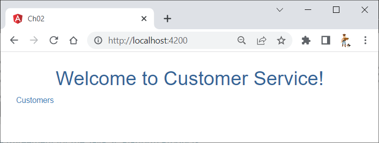

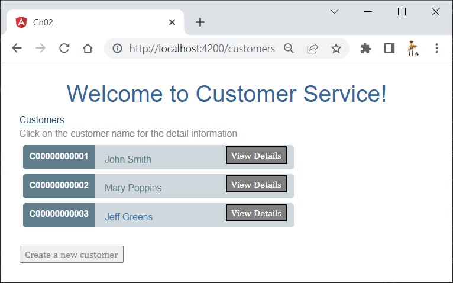

## Package #2: Config Server

This package contains two services: Config Server and Customer Service.

To build and run, execute the following command:

```windows
C:spring-cloud> cd "2. Config Server"
C:spring-cloud> build_and_run.bat
```

It will start two windows, one is the Config Server, the other is the Customer Service 
SpringBoot application.

The default port at which the Config Server listens is: `2101`.
The default port at which the Customer Service listens is: `200`.

You can use the same frontend Angular app of Package #1 to access the Customer Service.

Additionally, you can use PostMan to access the Config Server and the Customer Service.

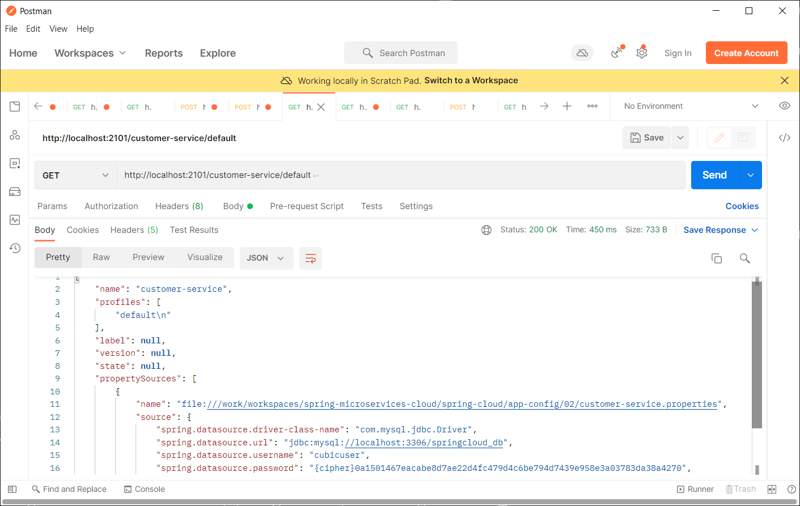

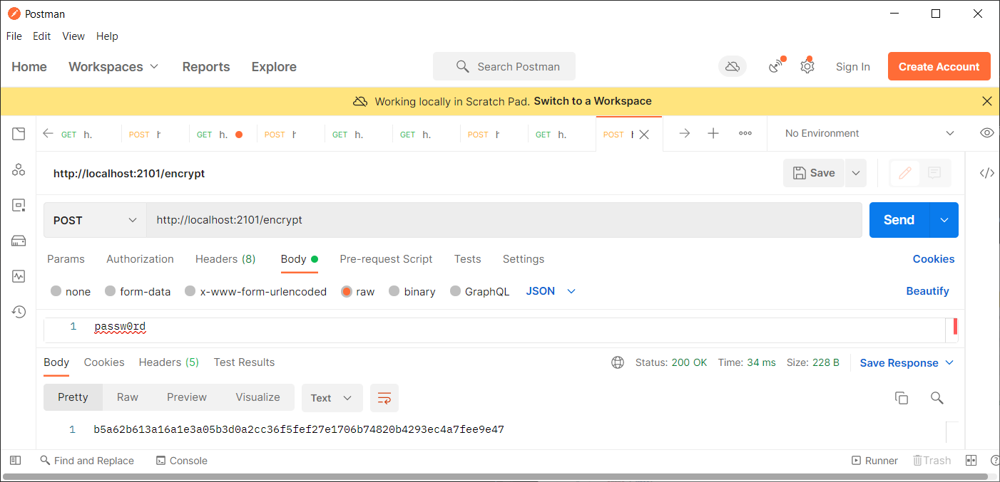


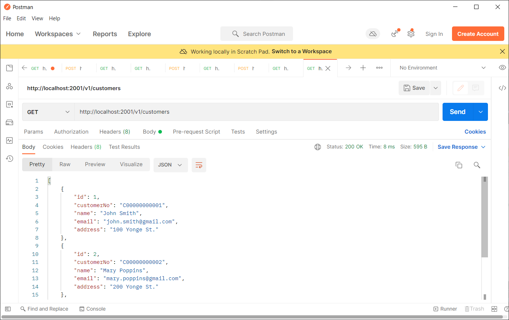

## Package #3: Service Registry & Discovery (Config Server + Eureka Server)

This package is extended based on Package #2 and mainly demonstrates the Service Registration
and Discovery (using Eureka and Ribbon). It contains four services: 
 
- Config Server
- Eureka Server
- Customer Service
- Account Service

To build and run, execute the following command:

```windows
C:spring-cloud> cd "3. Service Registry & Discovery"
C:spring-cloud> build_and_run.bat
```

It will start five servers/services:

- one Config Server: listens at port `2101`
- one Eureka Server: listens at port `2201`
- one Customer Service: listens at port `2001`
- two Account Services: listens at port `2011` and `2012`

You can use the same frontend Angular app of Package #1 to access the Customer Service.

Additionally, you can use PostMan to access these servers

After Eureka starts but before Customer Service and Account Services start, you can access 
the admin console of Eureka server on browser using URL: http://localhost:2201

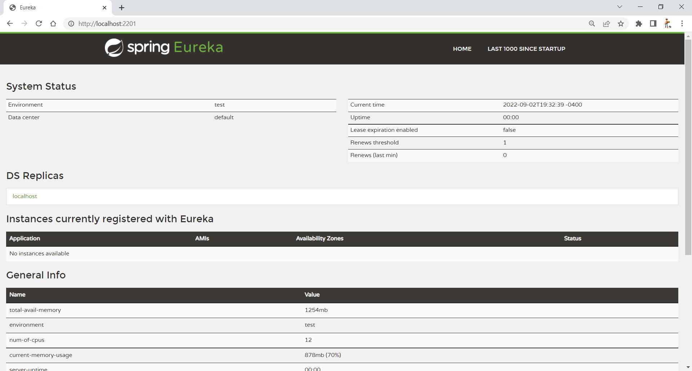

After all servers are up running, you can see the status of these services in the admin
console of Eureka server.

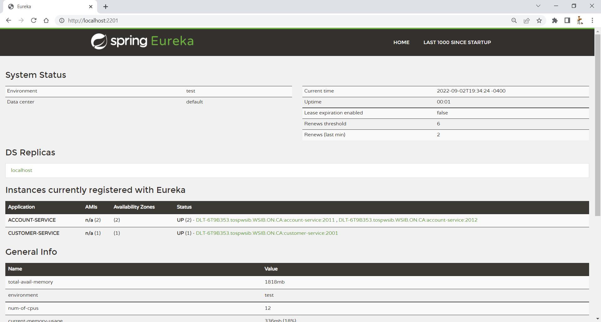

Then you can issue a REST API invocation to the Customer Service, or from the frontend
app, using http://localhost:2001/v1/customers service endpoint, and observe logs of the 
two Account Services. The Customer Service uses the service name of Account Service via 
Ribbon to access them using round-robin strategy. If you bring down one of the Account 
Service, the Customer Service will not be impacted. You can observe all REST API 
invocations occurring in the only running Account Service.

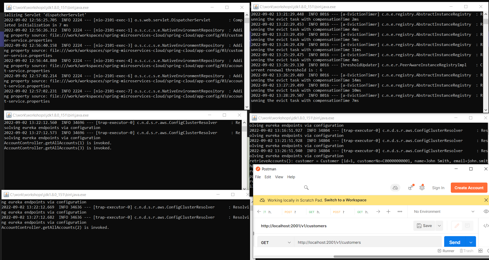

The REST API http://localhost:2001/v1/customers is using the FeignClient to access the 
Account Service. You can revise the `CustomerServiceImpl.java` class in the Customer
Service to use different service discovery clients.

```java
//	Option #1: Looking up service instances with Spring DiscoveryClient
//	@Autowired
//	private AccountServiceUsingSpringDiscoveryClient accountServiceDiscoveryClient;
	
//	Option #2: Invoking services with Ribbon-aware Spring RestTemplate
//	@Autowired
//	private AccountServiceClientUsingRibbonAwaredSpringRestTemplate accountServiceDiscoveryClient;
	
//	Option #3: Invoking services with Netflix Feign client
	@Autowired
	private AccountServiceUsingFeignClient accountServiceDiscoveryClient;
```

In fact, in the `CustomerServiceImpl.java` class, it also defined all three clients and
exposes a REST API to let the invoker specify one of three service discovery clients to 
invoke the Account Service. More specifically, the SpringDiscoveryClient strategy uses
a program controlled backwards round-robin pattern.

- http://localhost:2001/v1/customers/client/SpringDiscoveryClient
- http://localhost:2001/v1/customers/client/RibbonAwaredSpringRestTemplate
- http://localhost:2001/v1/customers/client/FeignClient

## Package #4: Service Resiliency Pattern (Config Server + Eureka Server + Hystrix)

This package is extended based on Package #3 and mainly demonstrates the following Resiliency 
Patterns using Netflix’s Hystrix library.

- Client-side load balancing (not included, it is already demonstrated in package #3)
- Circuit breakers
- Fallbacks
- Bulkheads

It contains four services:

- Config Server
- Eureka Server
- Customer Service
- Account Service

There are two Customer Services to demonstrate two perspectives:

- CubicCustomerService: demonstrates above three resiliency patterns using Netflix's Hystrix library
- CubicCustomerService-2: demonstrates a custom strategy, ThreadLocalAwareStrategy.

### Build & Run for Netflix Hystrix features without the custom strategy

To build and run for Netflix Hystrix features without the custom strategy, execute the 
following command:

```windows
C:spring-cloud> cd "4. Service Resiliency Patterns"
C:spring-cloud> build_and_run_nostrategy.bat
```

It will start four servers/services:

- one Config Server: listens at port `2101`
- one Eureka Server: listens at port `2201`
- one Account Service: listens at port `2011`
- one Customer Service: listens at port `2001`

You can use the same frontend Angular app of Package #1 to access the Customer Service.

Additionally, you can use PostMan to access these servers. When you issue the following REST
API call in PostMan,

```url
    http://localhost:2001/v1/customers/
```

Two out of three times, the response will contain a list of customer profiles, some customers
will have a list of accounts.

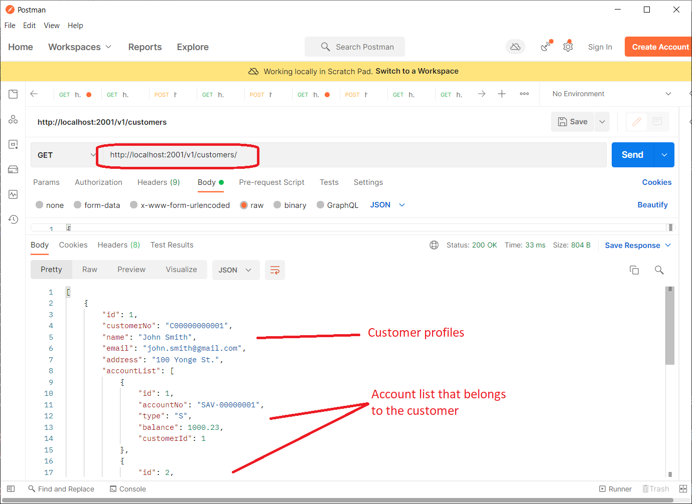

One of three times, the Customer Service will simulate a 11-second delay. The fallback method
is triggered by the Hystrix as we have configured a 3-second timeout. The response will be
returned in 3 seconds, with a blank customer profile list.

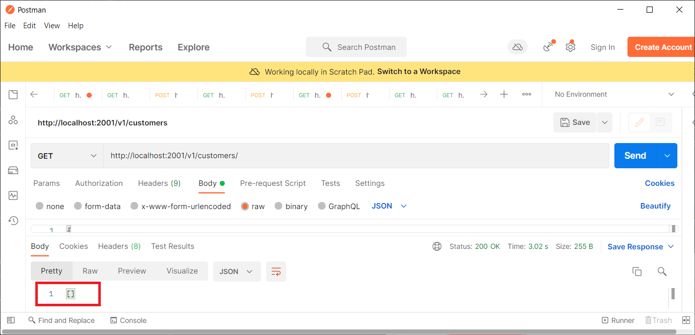

From the log of the Customer Service, you can observe that the fallback method, retrieveNoCustomerProfiles,
is called.

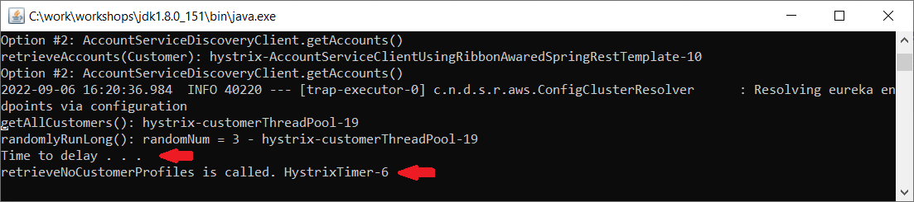

Moreover, if you shutdown the Account Service, then the response (in two out of three times)
will contain a list of customer profile, but the account list in each customer profile is
an empty list.

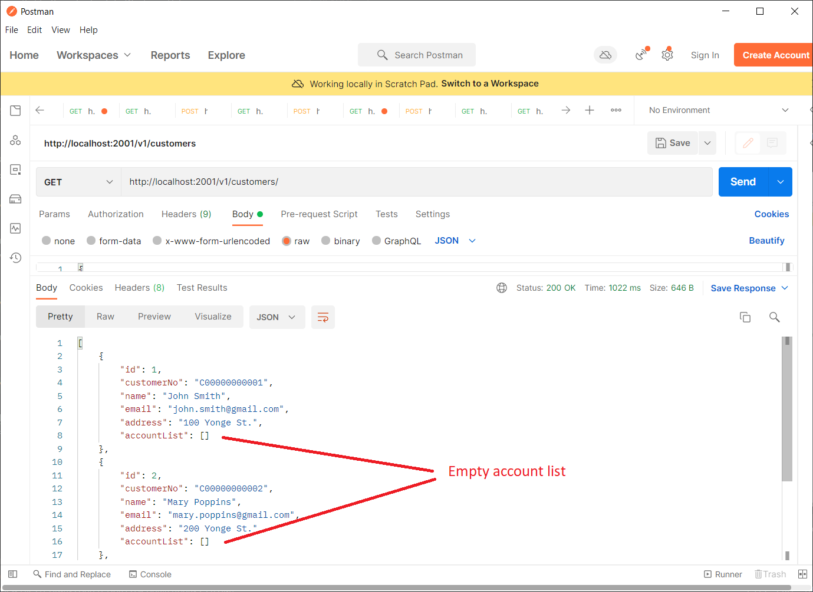

From the log of the Customer Service, you can observe that the fallback method, retrieveAccounts(Customer),
is called. 

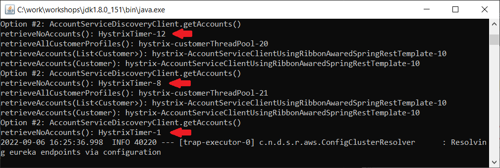

- CubicCustomerService-2: demonstrates a custom strategy, ThreadLocalAwareStrategy.

### Build & Run for Netflix Hystrix features with the custom strategy

To build and run for Netflix Hystrix features with a custom strategy, ThreadLocalAwareStrategy, 
execute the following command:

```windows
C:spring-cloud> cd "4. Service Resiliency Patterns"
C:spring-cloud> build_and_run_with_strategy.bat
```

It will start four servers/services:

- one Config Server: listens at port `2101`
- one Eureka Server: listens at port `2201`
- one Account Service: listens at port `2011`
- one Customer Service - 2: listens at port `2001`

By default, the custom strategy, ThreadLocalAwareStrategy, is enabled.

When you issue the REST API invocation `http://localhost:2001/v1/customers/` on PostMan with
a header entry `tmx-correlation-id=1234567890`, you can see in the log of the CustomerService
that both the main thread and the Hystrix thread have the same context information that was
extracted from the header.

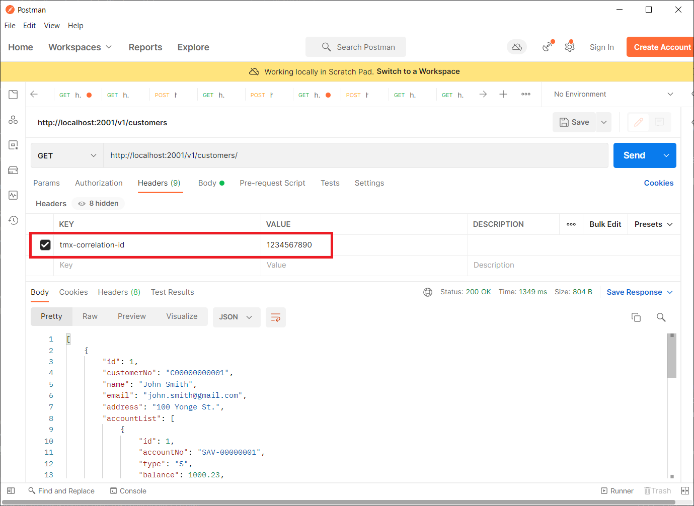

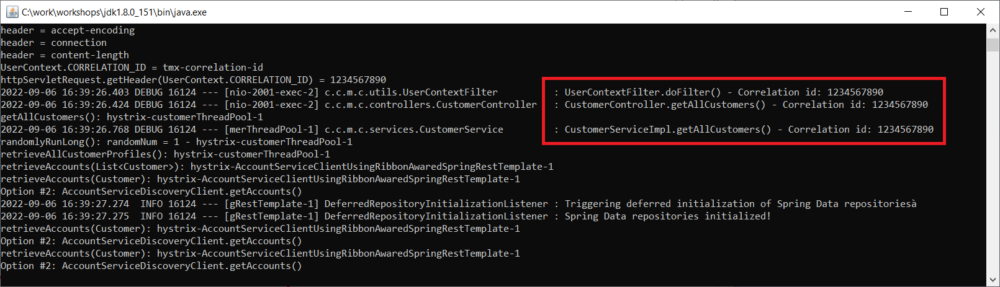

To further demonstrate this feature, you can restart the CustomerService-2 with
`--cubic.app.useThreadLocalAwareStrategy=false` option to disable the customer strategy.

```windows
C:spring-cloud> cd "4. Service Resiliency Patterns\CubicCustomerService-2"
C:spring-cloud> start java -jar target\customer-service-0.0.1-SNAPSHOT.jar --cubic.app.useThreadLocalAwareStrategy=false
```

Now when you re-issue the the REST API invocation `http://localhost:2001/v1/customers/` on PostMan with
a header entry `tmx-correlation-id=1234567890`, you can see in the log of the CustomerService
that only the main thread has the same context information that was extracted from the header,
but the Hystrix trhead does not have the same context.

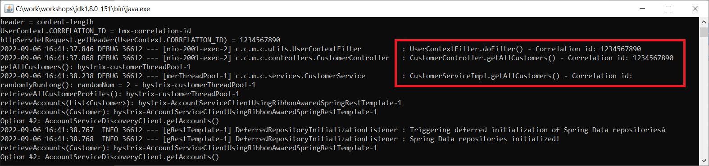

### Access Hystrix Dashboard

Both CustomerService and CustomerService-2 have included and enabled the Hystrix Dashboard
feature.

To access it, enter the following URL in a browser:

```url
    http://localhost:2001/hystrix
```

In the “Turbine Stream” box, enter the URL: `http://localhost:2001/actuator/hystrix.stream`

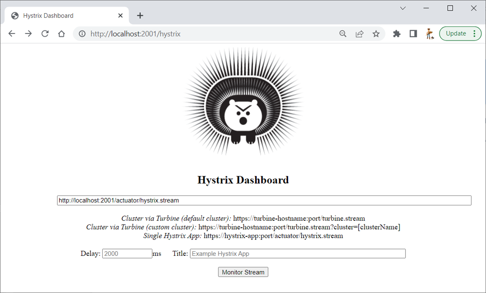

Then click the “**Monitor Stream**” button. After a few service invocation to the Customer Service,
you should be able to see the information is displayed in the dashboard.

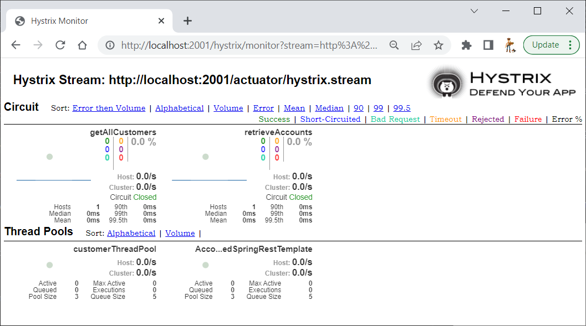