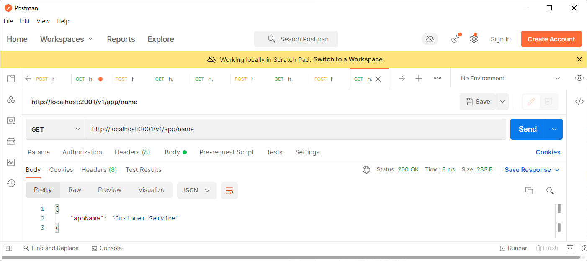
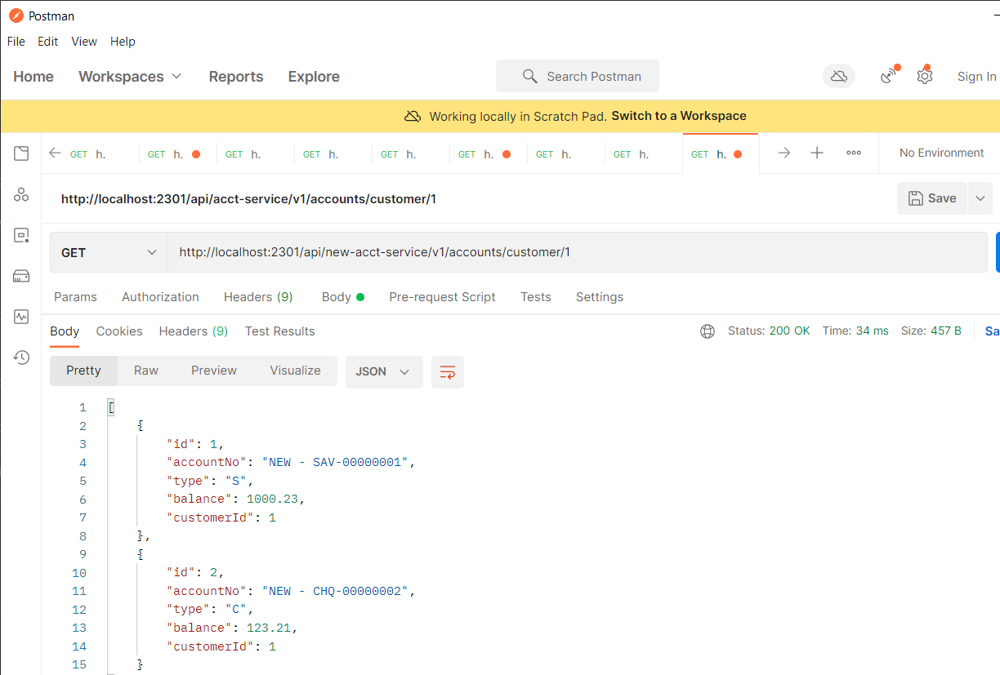
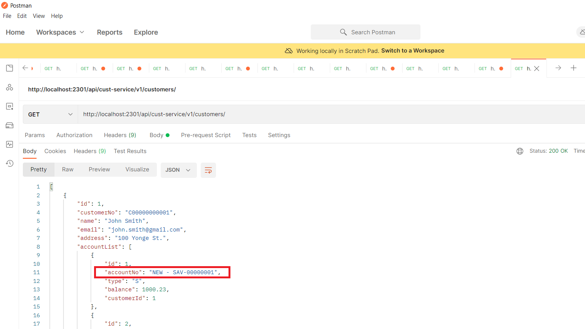
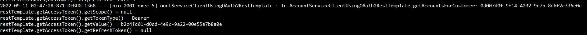
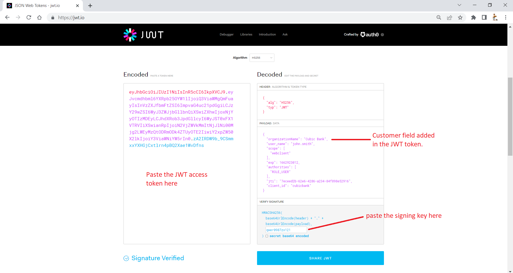
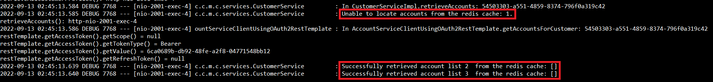

# Spring Cloud & Microservices

## Environment

### Java Environment

This project uses Java 1.8. All dependant libraries will be automatically downloaded by
Maven.

### JCE Unlimited Strength Jurisdiction Policy Files

You need to download "Java Cryptography Extension (JCE) Unlimited Strength Jurisdiction 
Policy Files for Java 1.8" from Oracle website.

- https://www.oracle.com/ca-en/java/technologies/javase-jce8-downloads.html

After download the package, unzip it and then copy/overwrite the following two files to 
`<JavaHome>/jre/lib/security` folder.

- local_policy.jar
- US_export_policy.jar

### Database

Each package contains a database schema file: `src/main/resources/db.sql`. You should use it
to create the database schema. 

The default database name is: `springcloud_db`

The default database connectivity information are stored under `app-conf/<package#>` directory.
It connects to `MySQL` database on the `localhost` at the port `3306`.
If you want to change this information, you need to make corresponding changes in these
configuration files.

All packages are using the username `cubicuser` and password `passw0rd` to access the 
database. The following commands will create the database user and grant privileges to 
the user in MySQL.

```sql
CREATE USER 'cubicuser'@'localhost' IDENTIFIED BY 'passw0rd';
GRANT ALL PRIVILEGES ON springcloud_db.* TO 'cubicuser'@'localhost' WITH GRANT OPTION;
```

You will also need to create database schema for each package using the `schema.sql` script 
under the `db-schema/<pkg#>` folder, where `<pkg#>` is the package number. For example, you
need to run the `db-schema/01/schema.sql` script to implement the required database schema
in order to run the package #1.

## Package #1: Run Angular Frontend App + SpringBoot Backend (Customer Service)

This package is a pure Angular Frontend App + SpringBoot Backend. It does not engage any
SpringCloud framework.

To build and run, execute the following command:

```windows
C:spring-cloud> cd "1. Base"
C:spring-cloud> build_and_run.bat
```

It will start two windows, one is the web server that hosts the Angular app, the other one
is the Customer Service SpringBoot application.

You then can go to `http://localhost:4200` on a browser and see the following output.

The default port that the backend Customer Service listens at is `2001`.


## Package #2: Config Server


This package contains two services: Config Server and Customer Service.

To build and run, execute the following command:

```windows
C:spring-cloud> cd "2. Config Server"
C:spring-cloud> build_and_run.bat
```

It will start two windows, one is the Config Server, the other is the Customer Service 
SpringBoot application.

The default port at which the Config Server listens is: `2101`.
The default port at which the Customer Service listens is: `200`.

You can use the same frontend Angular app of Package #1 to access the Customer Service.

Additionally, you can use PostMan to access the Config Server and the Customer Service.





## Package #3: Service Registry & Discovery (Config Server + Eureka Server)

### Overview


This package is extended based on Package #2 and mainly demonstrates the Service Registration
and Discovery (using Eureka and Ribbon). It contains four services: 
 
- Config Server
- Eureka Server
- Customer Service
- Account Service

To build and run, execute the following command:

```windows
C:spring-cloud> cd "3. Service Registry & Discovery"
C:spring-cloud> build_and_run.bat
```

It will start five servers/services:

- one Config Server: listens at port `2101`
- one Eureka Server: listens at port `2201`
- one Customer Service: listens at port `2001`
- two Account Services: listens at port `2011` and `2012`

You can use the same frontend Angular app of Package #1 to access the Customer Service.

Additionally, you can use PostMan to access these servers

After Eureka starts but before Customer Service and Account Services start, you can access 
the admin console of Eureka server on browser using URL: http://localhost:2201


After all servers are up running, you can see the status of these services in the admin
console of Eureka server.


Then you can issue a REST API invocation to the Customer Service, or from the frontend
app, using http://localhost:2001/v1/customers service endpoint, and observe logs of the 
two Account Services. The Customer Service uses the service name of Account Service via 
Ribbon to access them using round-robin strategy. If you bring down one of the Account 
Service, the Customer Service will not be impacted. You can observe all REST API 
invocations occurring in the only running Account Service.


The REST API http://localhost:2001/v1/customers is using the FeignClient to access the 
Account Service. You can revise the `CustomerServiceImpl.java` class in the Customer
Service to use different service discovery clients.

```java
//	Option #1: Looking up service instances with Spring DiscoveryClient
//	@Autowired
//	private AccountServiceUsingSpringDiscoveryClient accountServiceDiscoveryClient;
	
//	Option #2: Invoking services with Ribbon-aware Spring RestTemplate
//	@Autowired
//	private AccountServiceClientUsingRibbonAwaredSpringRestTemplate accountServiceDiscoveryClient;
	
//	Option #3: Invoking services with Netflix Feign client
	@Autowired
	private AccountServiceUsingFeignClient accountServiceDiscoveryClient;
```

In fact, in the `CustomerServiceImpl.java` class, it also defined all three clients and
exposes a REST API to let the invoker specify one of three service discovery clients to 
invoke the Account Service. More specifically, the SpringDiscoveryClient strategy uses
a program controlled backwards round-robin pattern.

- http://localhost:2001/v1/customers/client/SpringDiscoveryClient
- http://localhost:2001/v1/customers/client/RibbonAwaredSpringRestTemplate
- http://localhost:2001/v1/customers/client/FeignClient

## Package #4: Service Resiliency Pattern (Config Server + Eureka Server + Hystrix)

### Overview


This package is extended based on Package #3 and mainly demonstrates the following Resiliency 
Patterns using Netflix’s Hystrix library.

- Client-side load balancing (not included, it is already demonstrated in package #3)
- Circuit breakers
- Fallbacks
- Bulkheads

It contains four services:

- Config Server
- Eureka Server
- Customer Service
- Account Service

There are two Customer Services to demonstrate two perspectives:

- CubicCustomerService: demonstrates above three resiliency patterns using Netflix's Hystrix library
- CubicCustomerService-2: demonstrates a custom strategy, ThreadLocalAwareStrategy.

### Build & Run for Netflix Hystrix features without the custom strategy

To build and run for Netflix Hystrix features without the custom strategy, execute the 
following command:

```windows
C:spring-cloud> cd "4. Service Resiliency Patterns"
C:spring-cloud> build_and_run_nostrategy.bat
```

It will start four servers/services:

- one Config Server: listens at port `2101`
- one Eureka Server: listens at port `2201`
- one Account Service: listens at port `2011`
- one Customer Service: listens at port `2001`

You can use the same frontend Angular app of Package #1 to access the Customer Service.

Additionally, you can use PostMan to access these servers. When you issue the following REST
API call in PostMan,

```url
    http://localhost:2001/v1/customers/
```

Two out of three times, the response will contain a list of customer profiles, some customers
will have a list of accounts.


One of three times, the Customer Service will simulate a 11-second delay. The fallback method
is triggered by the Hystrix as we have configured a 3-second timeout. The response will be
returned in 3 seconds, with a blank customer profile list.


From the log of the Customer Service, you can observe that the fallback method, retrieveNoCustomerProfiles,
is called.


Moreover, if you shutdown the Account Service, then the response (in two out of three times)
will contain a list of customer profile, but the account list in each customer profile is
an empty list.


From the log of the Customer Service, you can observe that the fallback method, retrieveAccounts(Customer),
is called. 


- CubicCustomerService-2: demonstrates a custom strategy, ThreadLocalAwareStrategy.

### Build & Run for Netflix Hystrix features with the custom strategy

To build and run for Netflix Hystrix features with a custom strategy, ThreadLocalAwareStrategy, 
execute the following command:

```windows
C:spring-cloud> cd "4. Service Resiliency Patterns"
C:spring-cloud> build_and_run_with_strategy.bat
```

It will start four servers/services:

- one Config Server: listens at port `2101`
- one Eureka Server: listens at port `2201`
- one Account Service: listens at port `2011`
- one Customer Service - 2: listens at port `2001`

By default, the custom strategy, ThreadLocalAwareStrategy, is enabled.

When you issue the REST API invocation `http://localhost:2001/v1/customers/` on PostMan with
a header entry `tmx-correlation-id=1234567890`, you can see in the log of the CustomerService
that both the main thread and the Hystrix thread have the same context information that was
extracted from the header.


To further demonstrate this feature, you can restart the CustomerService-2 with
`--cubic.app.useThreadLocalAwareStrategy=false` option to disable the customer strategy.

```windows
C:spring-cloud> cd "4. Service Resiliency Patterns\CubicCustomerService-2"
C:spring-cloud> start java -jar target\customer-service-0.0.1-SNAPSHOT.jar --cubic.app.useThreadLocalAwareStrategy=false
```

or 

```windows
C:spring-cloud> cd "4. Service Resiliency Patterns\CubicCustomerService-2"
C:spring-cloud> start mvn spring-boot:run
```

Now when you re-issue the the REST API invocation `http://localhost:2001/v1/customers/` on PostMan with
a header entry `tmx-correlation-id=1234567890`, you can see in the log of the CustomerService
that only the main thread has the same context information that was extracted from the header,
but the Hystrix trhead does not have the same context.


### Access Hystrix Dashboard

Both CustomerService and CustomerService-2 have included and enabled the Hystrix Dashboard
feature.

To access it, enter the following URL in a browser:

```url
    http://localhost:2001/hystrix
```

In the “Turbine Stream” box, enter the URL: `http://localhost:2001/actuator/hystrix.stream`


Then click the “**Monitor Stream**” button. After a few service invocation to the Customer Service,
you should be able to see the information is displayed in the dashboard.


## Package #5: Service Gateway: Service routing with Spring Cloud and Zuul

### Overview


This package is extended based on Package #4 and mainly demonstrates the implementation of
a typical Service Gateway usage of service routing using Spring Cloud and Netflix's Zuul
library.

In this package, it contains the following services/servers:

- Config Server
- Eureka Server
- Zuul Server
- Special Route Service
- Customer Service
- Account Service
- New Account Service

To build and run all services inside this package, execute the following command:

```windows
C:spring-cloud> cd "5. Service routing with Spring Cloud and Zuul"
C:spring-cloud> build_and_run.bat
```

It will start the following servers/services:

- one Config Server: listens at port `2101`
- one Eureka Server: listens at port `2201`
- Zuul Server: listens at port `2301`
- Special Route Service: listens at port `2031`
- one Account Service: listens at port `2011`
- one New Account Service: listens at port `2021`
- one Customer Service: listens at port `2001`

You can verify that all services have been started by visit the Eureka server console at `http://localhost:2201/`.


After all services/servers are up running, you can see the routes being managed by the Zuul 
server by accessing the service endpoint at: `http://localhost:2301/actuator/routes`


You can access the Customer Service through the Zuul server using the following URL that is
exposed by the Zuul server:

```url
    http://localhost:2301/api/cust-service/v1/customers/
```


You can access the Account Service through the Zuul server using the following URL that is
exposed by the Zuul server:

```url
    http://localhost:2301/api/acct-service/v1/accounts/customer/1
```


Please note that, accessing the regular Account Service using the above URL may result in
accessing the new Account Service, as the Zuul server will route the 50% of service invocations
to the Account Service to the new version of the Account Service.

You can also access the new Account Service through the Zuul server using the following 
URL that is exposed by the Zuul server:

```url
    http://localhost:2301/api/new-acct-service/v1/accounts/customer/1
```



The Zuul server has implemented three filters:

- Pre-filter (TrackingFilter)
- Post-filter (ResponseFilter)
- Route-filter (SpecialRoutesFilter)

The TrackingFilter, a pre-filter, will inspect all incoming requests to the gateway and 
determine whether there’s an HTTP header called `tmx-correlation-id` present in the request. 
If the `tmx-correlation-id` isn’t present on the HTTP header, your Zuul TrackingFilter will 
generate and set the correlation ID.

You can observe its behaviour by issuing the service call to the Customer Service with or
without the `tmx-correlation-id` HTTP header.

For example, if you access the URL `http://localhost:2301/api/cust-service/v1/customers/` without
the `tmx-correlation-id` HTTP header.


You can observe in the log of the Zuul Server that a unique correlation ID is generated.


You can also observe the correlation ID is passed to the Customer Service


and the Account Service (or the New Account Service, depending on the AB testing logic)


You can also find in the header of the HTTP response from the service invocation using above
URL of the `tmx-correlation-id` field.


If you access the same URL with a specified `tmx-correlation-id` field, you will find the
header value is used and passed in all service invocations to the Customer Service and the
Account Service (and the New Account Service, depending on the AB testing logic), as well as
the HTTP response header.


In the ResponseFilter, a post-filter, inject the correlation ID back into the HTTP response 
headers being passed back to the caller of the service. This way, we can pass the correlation 
ID back to the caller without ever having to touch the message body. This is why you can
see the correlation is included in the HTTP Response header.

In the SpecialRoutesFilter, a Route-filter, we implemented an AB testing, i.e., 50% traffic
will be routed to the New Account Service. The New Account Service has the exact same logic
as the regular Account Service except it adds a prefix of "New - " to the `accountNo` field.

If you keep issuing the same call to the above URL (`http://localhost:2301/api/cust-service/v1/customers/`),
about 50% you will get the following output. Please note the `accoutNo` field.



It is also indicated in the log of the Zuul server.


## Securing Services

### Overview


This package is extended based on Package #5 and added security functionality for authentication
and authorization using OAuth2.

In this package, it contains the following services/servers:

- Config Server
- Eureka Server
- Zuul Server: implemented supports for OAuth2 
- Zuul Server 2: implemented supports for OAuth2 with JWT generation
- Auth Server: implemented supports for OAuth2
- Auth Server 2: implemented supports for OAuth2 with JWT generation
- Customer Service: implemented supports for OAuth2
- Customer Service 2: implemented supports for OAuth2 with JWT generation
- Account Service: implemented supports for OAuth2
- Account Service 2: implemented supports for OAuth2 with JWT generation

Please note that, in this package, we have disabled the `SpecialRoutesFilter` in the Zuul
server, so we will not need to include the Special Route Service and the New Account Service
starting this package.


### Sub-package 6-1: Implementation of OAuth2

To build and run all services inside this sub-package, execute the following command:

```windows
C:spring-cloud> cd "6. Securing Microservices"
C:spring-cloud> build_and_run_oauth2.bat
```

It will start the following servers/services:

- Config Server: listens at port `2101`
- Eureka Server: listens at port `2201`
- Zuul Server: listens at port `2301`
- Auth Server: listens at port `2501`
- Account Service: listens at port `2011`
- Customer Service: listens at port `2001`

You can verify that all services have been started by visit the Eureka server console at `http://localhost:2201/`.


#### Authentication and Obtain the generated OAuth2 token

Before accessing the Customer service or the Account service, you need to authenticate
against the Auth server. Access the authentication service endpoint `http://localhost:2501/oauth/token`
using `POST` method.

When issue the authentication service call, you need to provide the following information as
they are configured in the Auth Server (in-memory configuration):

- Authentication
  - Authentication type: `Basic Auth`
  - Username: `cubicbank` (this is the application name)
  - Password: `passw0rd`
- Request body (form-data):
  - grant_type: `password`
  - scope: `webclient`
  - username: `john.smith`
  - password: `password1`

For example, if you invoke the authentication service in Postman, you need to provide the
data as shown below.


In the response of the authentication service invocation, you should be able to see generated
tokens. Record the access token, which you will need in the next step to access the Customer
service and the Account service.


#### Validate access token

The Auth Server exposes an API, `http://localhost:2501/user`, for resource servers (e.g., 
the Customer service and the Account service) to validate tokens. You can invoke this API
using `GET` method with the access token that you just obtained in the last step.

Don't forget to clear the authentication type and the request body. Please note that you
need to add the Authorization header with the value of "`Bearer XXXXXX`", where `XXXXXX`
represents the access token that you obtained in the last step, and there is a space between
the "`Bearer`" and the access token.


#### Access Resource Servers

Now you can access the Account Service. If you access the account service, e.g., using the 
service endpoint at `http://localhost:2301/api/acct-service/v1/accounts/customer/1`, without
the access token, you will get the `HTTP 401 Unauthorized` error, as shown below.


If you access the same account service again with the access token, you should be able to 
obtain the expected result, as shown below.


If you access the Customer Service, e.g., using the service endpoint at `http://localhost:2301/api/cust-service/v1/customers/`,
with the access token, you will see both customer profile and account list are included in
the response. This means the access token was passed to both the Customer Service and the
Account Service by the Service Gateway (Zuul server).


You can also observe that the access token in the log of the Customer Service.



Currently, two user credentials are set up in-memory in the Auth Server:

- user #1:
  - username: `john.smith`
  - password: `password1`
  - role: `USER`
- user #2:
  - username: `mary.poppins`
  - password: `password2`
  - role: `ADMIN`

It is also configured in the Account Service that all authenticated users can access query APIs,
but only users with `ADMIN` role can perform the `DELETE` operation.

If you use `john.smith`'s access token to call the PUT operation on the account service
endpoint `http://localhost:2301/api/acct-service/v1/accounts/1`, you will get `403 Forbidden`
error, with the error message of "Access is denied" in the response, as shown below.


However, if you use `mary.poppins`'s access token to call the PUT operation on the same service
endpoint, it will run successfully.

### Sub-package 6-2: Implementation of OAuth2 with JWT Tokens

To build and run all services inside this sub-package, execute the following command:

```windows
C:spring-cloud> cd "6. Securing Microservices"
C:spring-cloud> build_and_run_oauth2_jwt.bat
```

It will start the following servers/services:

- Config Server: listens at port `2101`
- Eureka Server: listens at port `2201`
- Zuul Server 2: listens at port `2301`
- Auth Server 2: listens at port `2501`
- Account Service: listens at port `2011`
- Customer Service: listens at port `2001`

You can verify that all services have been started by visit the Eureka server console at `http://localhost:2201/`.


#### Authentication and Obtain the generated JWT token

Before accessing the Customer service or the Account service, you need to authenticate
against the Auth server. Access the authentication service endpoint `http://localhost:2501/oauth/token`
using `POST` method.

When issue the authentication service call, you need to provide the following information as
they are configured in the Auth Server (in-memory configuration):

- Authentication
  - Authentication type: `Basic Auth`
  - Username: `cubicbank` (this is the application name)
  - Password: `passw0rd`
- Request body (form-data):
  - grant_type: `password`
  - scope: `webclient`
  - username: `john.smith`
  - password: `password1`

For example, if you invoke the authentication service in Postman, you need to provide the
data as shown below.


In the response of the authentication service invocation, you should be able to see generated
JWT tokens. Record the access token, which you will need in the next step to access the 
Customer service and the Account service.


Please note, the actual token itself isn’t directly returned as JSON. Instead, the JSON body 
is encoded using a Base64 encoding. If you’re interested in seeing the contents of a JWT 
token, you can use online tools to decode the token. 

You can use Stormpath (http://jsonwebtoken.io), or http://jwt.io, to decode the JWT access 
token.



If you put the signing key in the "Verify Signature" section, it can verify the signature of
the JWT token using the provided signing key. The signing key is specified in the 
`src/main/resources/application.properties` under the Auth Server 2 project.

Please also note the `organizationName` field that was added to the JWT token. We will show
that it is extracted by the Customer Service.

#### Validate access token

The Auth Server exposes an API, `http://localhost:2501/user`, for resource servers (e.g.,
the Customer service and the Account service) to validate tokens. You can invoke this API
using `GET` method with the access token that you just obtained in the last step.

Don't forget to clear the authentication type and the request body. Please note that you
need to add the Authorization header with the value of "`Bearer XXXXXX`", where `XXXXXX`
represents the access token that you obtained in the last step, and there is a space between
the "`Bearer`" and the access token.


#### Access Resource Servers

Now you can access the Customer Service, e.g., using the service endpoint at `http://localhost:2301/api/cust-service/v1/customers/`,
with the JWT access token, you will see both customer profile and account list are included 
in the response. This means the access token was passed to both the Customer Service and the
Account Service by the Service Gateway (Zuul server).


You can also observe that the JWT access token in the log of the Customer Service.


You can also observe that the extracted custom field in the JWT token in the log of the 
Customer Service.


## Event-driven architecture with Spring Cloud Stream

### Overview


This package is extended based on Package #6 and added messaging functionality (using Kafka) 
and Cache feature (using Redis).

In this package, it contains the following services/servers:

- Config Server
- Eureka Server
- Zuul Server
- Auth Server (OAuth2 only, no JWT)
- Customer Service: this is partly done for the demonstration of basic access to Kafka
(using default input and output) and Redis (but not record eviction) 
- Customer Service 2: this is a fully completed version with using custom input and output
of Kafka, and Redis eviction upon account update events from the Account Service
- Account Service

Please note that, in this package, we have disabled the `SpecialRoutesFilter` in the Zuul
server, so we will not need to include the Special Route Service and the New Account Service
starting this package.

To build and run all services inside this sub-package, execute the following command:

```windows
C:spring-cloud> cd "7. Event-driven architecture with Spring Cloud Stream"
C:spring-cloud> build_and_run.bat
```

It will start the following servers/services:

- Zookeeper Server: listens at the default port `2181`
- Kafka Server: listens at the default port `9092`
- Redis Server: listens at the default port `6379`
- Config Server: listens at port `2101`
- Eureka Server: listens at port `2201`
- Zuul Server: listens at port `2301`
- Auth Server: listens at port `2501`
- Account Service: listens at port `2011`
- Customer Service: listens at port `2001`

You can verify that the Zookeeper Server is up running without error by checking its running window.


You can verify that the Kafka Server is up running without error by checking its running window.


You can verify that the Redis Server is up running without error by checking its running window.


You then can verify that all services have been started by visit the Eureka server console at `http://localhost:2201/`.


### Authentication and Obtain the generated OAuth2 token

First, you need to authenticate against the Auth server. Access the authentication service endpoint 
`http://localhost:2501/oauth/token` using `POST` method with the following information"

- Authentication
  - Authentication type: `Basic Auth`
  - Username: `cubicbank` (this is the application name)
  - Password: `passw0rd`
- Request body (form-data):
  - grant_type: `password`
  - scope: `webclient`
  - username: `john.smith`
  - password: `password1`

If you invoke the authentication service in Postman, you need to provide the data as shown below.


In the response of the authentication service invocation, you should be able to see generated
tokens. Record the access token, which you will need in the next step to access the Customer
service and the Account service.


### Access the Customer Service

Next you can retrieve all customer profiles using the following REST API that is exposed by 
the Customer Service.

```url
  (GET) http://localhost:2301/api/cust-service/v1/customers
```

If it ran successfully, you should be able to obtain the response as shown below.


You can observe in the log of the Customer Service that the account lists for each customer
is not able to be retrieved from the Redis cache and hence is retrieved from the Account 
Service.


Now if you retrieve customer profiles again, you should be able to obtain the same result,
but from the Redis cache. You can verify this by observing the log of the Customer Service,
as shown below.


### Update the account information

Now you can update the information of one account in the Account Service by accessing the 
following service endpoint.

```url
  (PUT) http://localhost:2301/api/acct-service/v1/accounts/{accountId}
```

For example, let's update the account #1, which belongs to customer #1, with a new balance
of 3000.21.


In the log of the Account Service, you can observe that an event is published to Kafka queue
regarding this accountId and customerId.


In the log of the Customer Service, you can observe that an UPDATE event is received for above
accountId and customerId, and the account list for customer #1 is evicted from Redis cache.


When you retrieve the customer profile list again from the Customer Service, you should get
the result with the updated account information (for customer #1).


This is because the Customer Service retrieves the account list for customer #1 directly from 
the Account Service, while retrieves the account lists for customer #2 and #3 from the Redis
cache.



## 8. Distributed Logging and Tracing with Spring Cloud Sleuth and Zipkin

### Overview

This package is extended based on Package #7, and added distributed logging and tracing using 
Spring Cloud Sleuth and Zipkin 

In this package, it contains the following services/servers:

- Config Server
- Eureka Server
- Zuul Server
- Auth Server (OAuth2 only, no JWT)
- Customer Service: this is partly done for the demonstration of basic access to Kafka
  (using default input and output) and Redis (but not record eviction)
- Customer Service 2: this is a fully completed version with using custom input and output
  of Kafka, and Redis eviction upon account update events from the Account Service
- Account Service

Please note that, in this package, we have disabled the `SpecialRoutesFilter` in the Zuul
server, so we will not need to include the Special Route Service and the New Account Service
starting this package.

To build and run all services inside this sub-package, execute the following command:

```windows
C:spring-cloud> cd "8. Distributed Logging and Tracing"
C:spring-cloud> build_and_run.bat
```

It will start the following servers/services:

- Zookeeper Server: listens at the default port `2181`
- Kafka Server: listens at the default port `9092`
- Redis Server: listens at the default port `6379`
- Zipkin Server: listens at the default port `9411`
- Config Server: listens at port `2101`
- Eureka Server: listens at port `2201`
- Zuul Server: listens at port `2301`
- Auth Server: listens at port `2501`
- Account Service: listens at port `2011`
- Customer Service: listens at port `2001`

You can verify that the Zookeeper Server is up running without error by checking its running window.


You can verify that the Kafka Server is up running without error by checking its running window.


You can verify that the Redis Server is up running without error by checking its running window.


You can verify that the Zipkin Server is up running without error by checking its running window.


You then can verify that all services have been started by visit the Eureka server console at `http://localhost:2201/`.


### Authentication and Obtain the generated OAuth2 token

First, you need to authenticate against the Auth server. Access the authentication service endpoint
`http://localhost:2501/oauth/token` using `POST` method with the following information"

- Authentication
  - Authentication type: `Basic Auth`
  - Username: `cubicbank` (this is the application name)
  - Password: `passw0rd`
- Request body (form-data):
  - grant_type: `password`
  - scope: `webclient`
  - username: `john.smith`
  - password: `password1`

If you invoke the authentication service in Postman, you need to provide the data as shown below.


In the response of the authentication service invocation, you should be able to see generated
tokens. Record the access token, which you will need in the next step to access the Customer
service and the Account service.


#### Access the Customer Service

Next you can retrieve all customer profiles through the Zuul Server using the following REST 
API that is exposed by the Customer Service.

```url
  (GET) http://localhost:2301/api/cust-service/v1/customers
```

If it ran successfully, you should be able to obtain the response as shown below.


If the look at the header of the response, you can find the trace id in the `tmx-correlation-id`
field.


You can the service name, trace id, span id and the status of sending log to the Zipkin server
in the log of the Zuul Server.


Similarly, you can observe the same information in the log of the Customer Service. Please note
that account lists for all customers are able to retrieve from the Redis cache, so all span ids
are the same.


Now go to the Zipkin server by entering the URL of `http://localhost:9411` in your browser.
You can see the above transactions in the Zipkin console.


You can drill down by clicking the entry and should be able to see all transactions are 
to retrieve account lists from the Redis cache. That's why all span ids are the same.


### Update the account information

Now you can update the information of one account in the Account Service by accessing the
following service endpoint.

```url
  (PUT) http://localhost:2301/api/acct-service/v1/accounts/{accountId}
```

For example, let's update the account #1, which belongs to customer #1, with a new balance
of 3000.32.


Then an UPDATE event is published to Kafka queue regarding this accountId and customerId. 
Consequently, the Customer Service receives the event for above accountId and customerId, 
and the account list for the affected customer (#1) is evicted from Redis cache.

You can see this transaction in the Zipkin console.


If you drill down this transaction, you can see the following details.


When you retrieve the customer profile list again from the Customer Service, the Customer Service 
retrieves the account list for customer #1 directly from the Account Service, while retrieves 
the account lists for customer #2 and #3 from the Redis cache.


Click the latest transaction to see the details.


